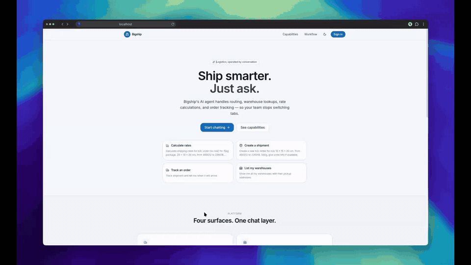

# Bigship AI Agent

FastAPI microservice that exposes a LangGraph + LangChain agent for the Bigship dashboard. The agent uses the `bigship-sdk` to call Bigship API methods step-by-step, with per-chat-session memory via `SqliteSaver` and encrypted credential storage via `EncryptedCredentialStore`.

## Demo in action

[](https://cdn-r2.agamya.dev/bigship/bigship-ai-agent-demo.mp4)

> Click the animation to watch the full video. GitHub doesn't render inline `<video>` embeds for external URLs, so this is an animated preview.

## Layout

```
bigship-ai-agent/
  agent/        # backend: FastAPI + LangGraph (mirrors frontend/)
  frontend/     # Vite + React SPA (node build → nginx serve)
  tests/        # pytest suite (pythonpath=["."])
  data/         # SQLite volume mount (git-ignored except .gitkeep)
  docs/         # ENV.md, DEPLOY.md
  scripts/      # smoke.sh, backup.sh
  Dockerfile
  docker-compose.yml
```

## Setup

```bash
# Backend deps (bigship-sdk pinned to GitHub commit in pyproject.toml)
uv sync --group dev

# Frontend deps
cd frontend && npm ci
```

See `docs/DEPLOY.md` for VPS deploy and `docs/ENV.md` for variables.

## Environment

| Variable | Default | Description |
|---|---|---|
| `OPENROUTER_API_KEY` | (required) | OpenRouter API key |
| `LLM_MODEL` | (required) | Model to use via OpenRouter |
| `JWT_SECRET` | (required) | HS256 signing secret |
| `CREDENTIAL_ENCRYPTION_KEY` | (required) | Base64-encoded 32-byte Fernet key for encrypting stored merchant credentials |
| `FRONTEND_ORIGIN` | `http://localhost:5173` | Comma-separated CORS origins, e.g. `https://app.example.com` |
| `CHECKPOINT_DB_PATH` | `/data/checkpoints.db` | SQLite checkpoint database path (compose mounts `./data:/data`; local override `./checkpoints.db`) |
| `AGENT_PORT` | `8000` | Port for the FastAPI service |
| `MAX_TOOL_CALLS` | `10` | Max recursive tool calls per turn |
| `JWT_EXPIRY_MINUTES` | `1440` | Login token TTL |

Frontend build-time: `VITE_API_URL` — empty = same-origin via nginx proxy (recommended prod), `http://localhost:8000` local, or `https://api.example.com` split-domain.

## Run

```bash
uv run uvicorn agent.service:app --port 8000
# or: uv run bigship-agent
```

Frontend:

```bash
cd frontend && npm run dev   # VITE_API_URL=http://localhost:8000
```

## API

| Method | Path | Body | Description |
|---|---|---|---|
| POST | `/auth/login` | `{user_name, password, access_key}` | Login / create merchant account, returns JWT |
| POST | `/auth/logout` | — | Evict cached client (Bearer required) |
| GET | `/auth/me` | — | Current account info (Bearer required) |
| GET/POST/DELETE | `/sessions...` | | Chat session CRUD (Bearer required) |
| POST | `/chat` | `{thread_id, message}` | Send a chat message; returns the agent's response |
| POST | `/chat/stream` | `{thread_id, message}` | SSE-streamed chat |
| GET | `/health` | — | Liveness check |

## Agent Tools

The agent exposes 15 tools derived from the Bigship SDK:

- `get_profile` — merchant profile and wallet balance
- `save_warehouse` — create a new warehouse
- `get_warehouse_list` — list warehouses with pagination
- `update_warehouse` — update an existing warehouse
- `get_package_types` — available package types
- `get_payment_modes` — available payment modes by segment
- `get_risk_types` — available risk types
- `calculate_rate` — calculate shipping rates
- `create_order` — create a shipment order
- `get_serviceable_couriers` — list couriers for an order
- `place_order` — confirm an order with a courier
- `cancel_order` — cancel an order
- `track_order` — track an order
- `get_order_detail` — get detailed order information
- `download_document` — download invoice, label, ewaybill, or manifest

## Development

```bash
# Run tests
uv run pytest tests/ -v

# Lint
uv run ruff check agent/ tests/

# Typecheck
uv run mypy agent/
```

## Security

- Merchant credentials are encrypted at rest using Fernet symmetric encryption.
- Passwords are hashed with bcrypt before storage.
- The service API key guard prevents unauthorized access to the agent endpoints.
- LLM exception details are not exposed to clients; internal errors are logged server-side only.
